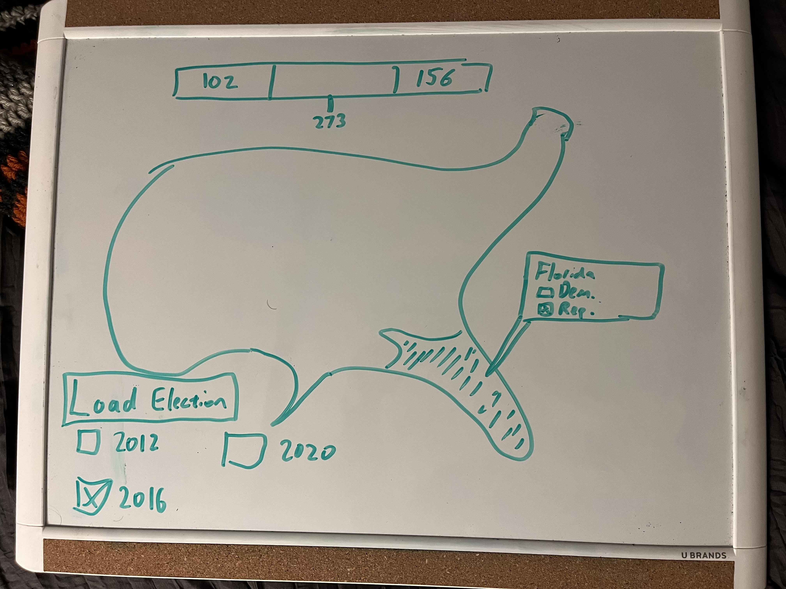
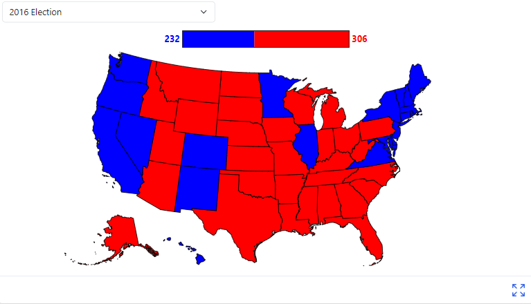
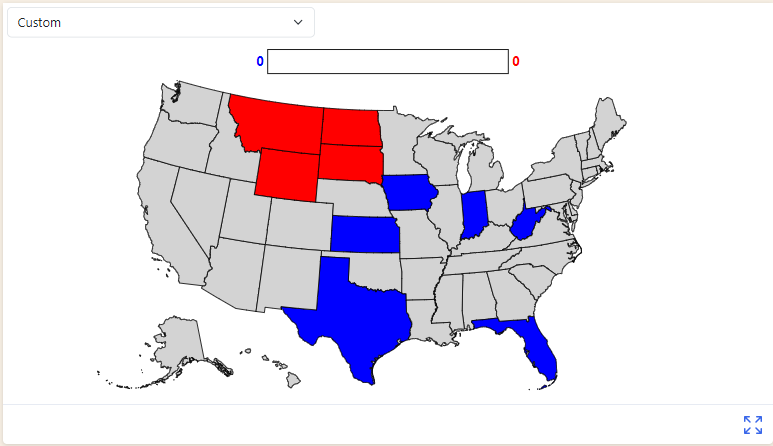

# Data Visualization Project

## Data

For my final project I intend to create a US election visualization dashboard, loaded with data from several recent presidential elections and allowing users to create their own hypothetical "what if?" scenarios.

## Questions & Tasks

The following tasks and questions will drive the visualization and interaction decisions for this project:

 * What impact would, for example, a flipped state have on a federal election?
 * What patterns can be extrapolated from election data relative to various demographic parameters?

## Sketches

This sketch shows the main intended view of my viz. (Admittedly, not great artwork - that's why I have computers do it for me.) Users will be able to hover over a state and adjust hypothetical election scenarios, as well as viewing demographic data about each state and loading data from elections likely dating back to around 2000. A second view will allow users to see more detailed demographic information about a state, as well as its electoral history.

## Prototypes

I’ve created a [proof of concept visualization](https://vizhub.com/IanCoolidge0/758647f837c84e07894da40183b520fb) as part of a previous assignment that shows statewide election data for the 2020 election.

## Open Questions

The New York Times and FiveThirtyEight have made probably thousands of such visualizations at this point! Throughout the project I'll be looking at what I want to accomplish to stand out and create unique insights that don't typically appear in election visualizations.

## Project Self-Critique and Reprioritization (4/11)

So far, I was able to achieve much of the basic functionality I set out to create with my visualization. Users are able to visualize presidential elections and view specific numbers in each state for various elecftion years. The following weeks will focus much more on answering the two questions above - for the first question, allowing users to enter their own election data, and for the second question, creating a second view that looks at a specific state and provides additional demographic information.

In response to the open question on how to make my visualization stand out relative to the various available US election vizzes, I have settled on focusing on comprehensiveness wherever possible. The dataset I am using for presidential and senate elections provides highly specific numeric fields that can allow users to very precisely measure election outcomes that might not always be possible in simpler visualizations. However, as I continue adding features over the next few weeks I plan to prioritize simplicity in the main view, so that users that don't need massive amounts of comprehensive data can get something easily digestible.

## Project Progress (4/17)

The project is coming much closer to completion, with only a few key features left to add! This week, I focused on two main features. First, I built the electoral vote counter at the top of the visualization, which shows the total democratic and republican votes in each election. Second, I added a 'Custom' election option that allows the user to click on states in order to cycle through and create their own 'what-if' visualizations, which was one of my key goals for the final weeks of the course. Screenshots demonstrating each of these new features can be seen below.

Notably, automatic recounting of electoral votes in the custom visualization tab is not implemented yet. My two tasks for next week are: implement this, and create a preliminary single-state view accessed by (probably) right clicking on a state in a given election year.
