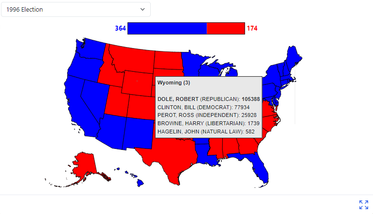

# Data Visualization Project

## Overview

For my final project I have created a US election visualization dashboard, loaded with data from recent presidential elections from 1976 through 2020 as well as allowing users to create their own hypothetical "what if?" scenarios and view the possible results in the modern Electoral College.

The full visualization in VizHub can be found [here](https://vizhub.com/IanCoolidge0/78fa361bb4ca4fd98beda6a9f3581787).

## Questions & Tasks

The following tasks and questions drove the visualization and interaction decisions for this project:

 * What impact would, for example, a flipped state have on a federal election?
 * What patterns can be extrapolated from election data relative to various demographic parameters?

## Data

The primary dataset used for presidential election data is from [Kaggle](https://www.kaggle.com/datasets/tunguz/us-elections-dataset?resource=download).

Supplementary data for electoral college vote allocation is from the [National Archive](https://www.archives.gov/electoral-college/allocation).

## Functionality

The main view of the project is shown in the screenshot below. The user is able to pick from a dropdown with options to view the results of any presidential election between 1976 and 2020. In the future, if more elections were to be added to the dataset, they would be automatically put into this dropdown once the dataset was updated. In addition to showing the outcome of each state, a counter near the top of the screen shows the final Electoral College vote counts for that election.

When looking at a given election, the user can mouse over any state to show a hover adornment. This adornment provides much more detailed information regarding the electoral outcome of the state. In particular, it shows the name of the state and its electoral vote allocation, as well as listing each candidate, party, and vote count. The winning candidate's name and party are **bolded**.

The visualization also provides users with a "playground" in which to imagine what result custom election results would have in the Electoral College. By clicking on the 'Custom' item at the bottom of the dropdown menu, the user will intially get an empty electoral map:

This will disable the hover adornments. Users can then left-click on the states to cycle them through democratic, republican, and "other", creating a custom electoral map:

In addition to the functionality above, this visualization implements a second view. By right-clicking on a state in any election, the user will be brought to a line chart which will show the Democratic versus Republican vote counts of that state over time, for the entire electoral range. This allows users to see trends that have occurred in specific states. For example, the following shows the state of Nevada:

By selecting a different year in the dropdown menu, the user can then return to the original full-country view.

## Limitations

The scope of this project narrowed slightly due to technical and time constraints, but I still learned a lot throughout creating this visualization. In the future, it would be interesting to harness data on elections beyond just the presidential election, as well as putting more consideration into the many third parties that have received votes over the years. Overall though, I'm really happy with how this final product turned out.

## Credits

Several of the views used in this visualization, in particular the chloropleth map code and the line chart axes, were partially adapted from the VizHub templates created by Prof. Kelleher. 
